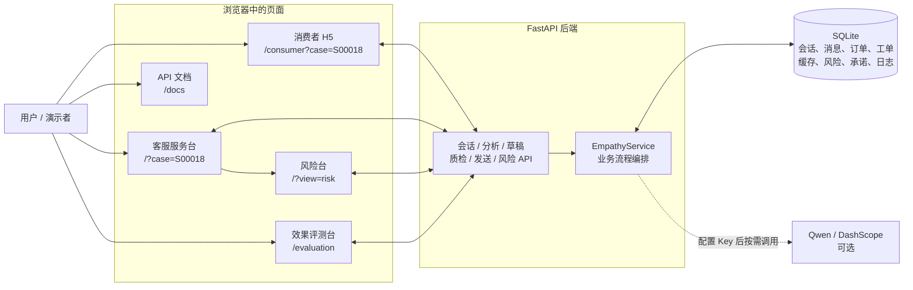
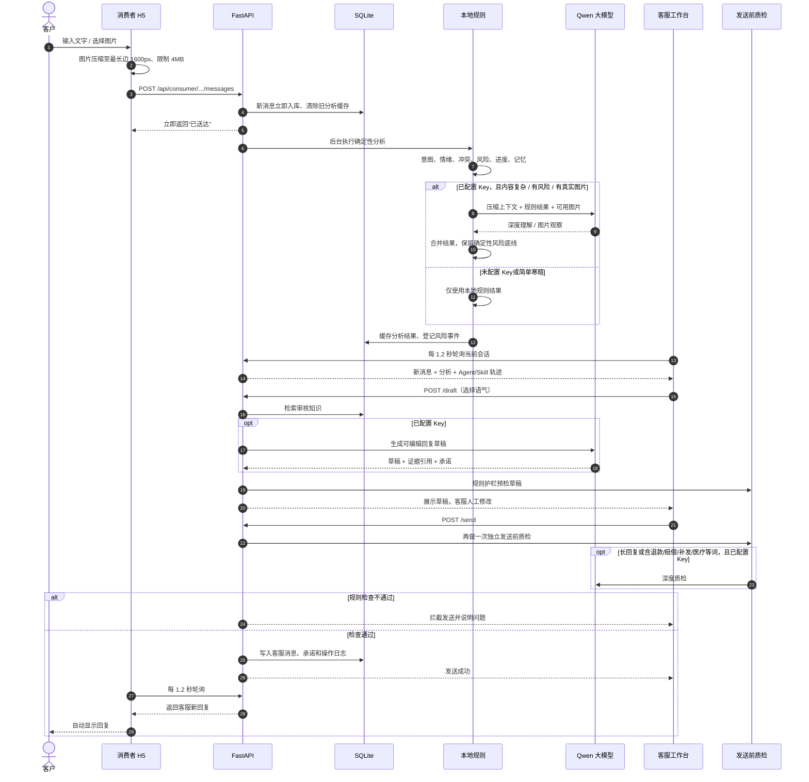
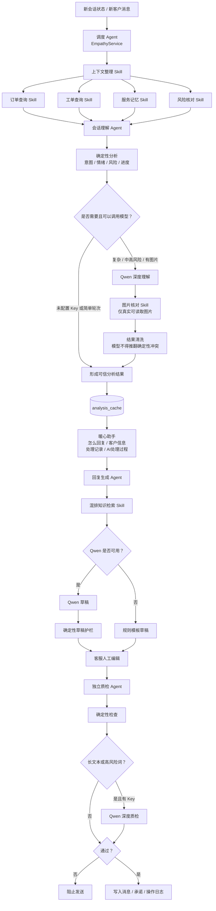
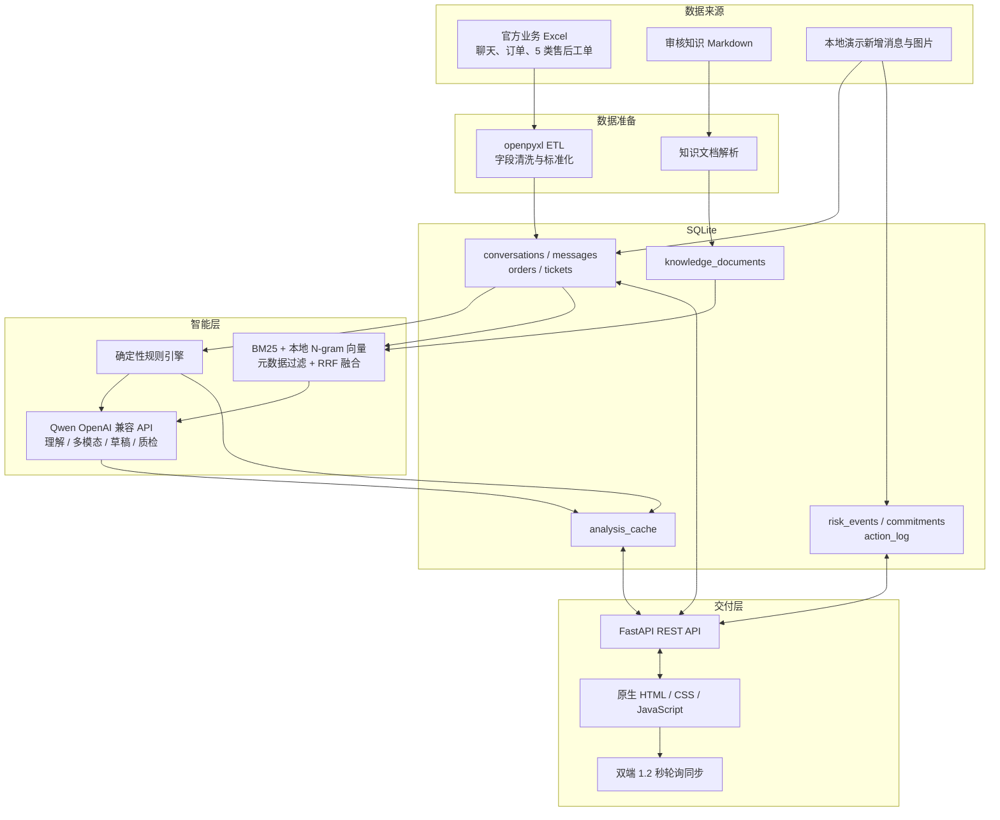
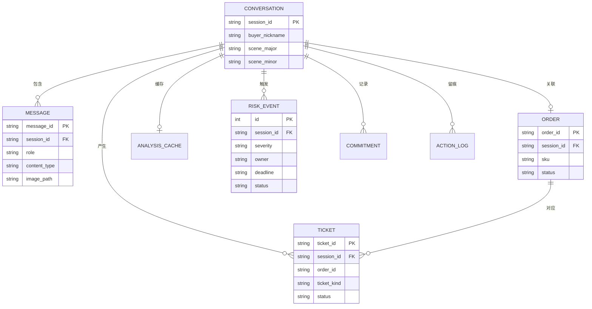

# 共情双舱：项目全景图

> 这份文档回答三个问题：项目有哪些页面、客户一句话如何走完整条链路、所谓 Agent/Skill 编排在代码里到底是什么。

## 1. 一句话定位

这是一个面向美妆电商人工客服的“双端 + 风险协同”演示系统：消费者发消息或图片，后端把聊天、订单、工单和服务记忆合并分析，客服工作台获得意图、情绪、风险、下一步和回复草稿；回复发送前必须经过独立质检，高风险事件进入风险台跟踪。

## 2. 项目不只有服务台

| 页面 | 入口 | 已实现的主要功能 |
| --- | --- | --- |
| 消费者 H5 | `/consumer?case=S00018` | 查看订单与聊天；发送文字；拍照/上传 JPG、PNG、WebP；自动接收客服回复 |
| 客服服务台 | `/?case=S00018` | 4 个精选会话；聊天和证据；意图、情绪、风险、解决进度；客户信息；处理记录；AI 处理过程；生成、编辑和发送回复 |
| 风险台 | `/?view=risk` | 风险 KPI；全部/高风险/待分配筛选；查看证据；修改负责人、截止时间和状态；跳回关联会话 |
| 效果评测台 | `/evaluation` | 8 个可复算回归场景；理解/安全指标；Skill 路由；RAG 召回分数；最近一次 Qwen 耗时与 token |
| API 文档 | `/docs` | FastAPI 自动生成的接口说明与在线调试 |

说明：风险台与服务台共用 `frontend/index.html`，通过 `?view=risk` 切换内部视图，不是单独 HTML。左侧“消息 / 客户 / 工单”和部分顶部图标目前主要是视觉占位，不是完整独立页面。

## 3. 客户说一句话之后，系统完整做了什么

### 这条链路的关键设计

1. **消息先入库，模型后分析**：客户不需要等待模型推理，发送接口先返回，后台再预热分析。
2. **规则先行**：无论有没有 API Key，确定性规则都会先运行，识别色号冲突、不良反应、情绪关键词、重复索要图片等。
3. **模型按需调用**：真实图片、中高风险或非简单轮次才调用理解模型；简单问候、感谢、确认直接走本地快路径。
4. **人工最终确认**：模型只给建议，不自动退款、发货、修改工单或做医疗诊断。
5. **发送前再次质检**：客服修改过草稿后，系统检查的是最终待发送文本，而不是旧草稿。

## 4. Agent 编排图

### Agent 到底是不是“真 Agent”

当前代码中的 Agent 是**清晰分工的业务阶段**，由 `EmpathyService` 统一调度；不是四个独立进程，也没有使用 LangGraph、AutoGen 等 Agent 框架。

| Agent 名称 | 代码中的真实职责 | 是否一定调用大模型 |
| --- | --- | --- |
| 调度 Agent | 决定先跑规则、是否调用模型、是否检索知识、是否进入深度质检 | 否 |
| 会话理解 Agent | 汇总聊天、订单、工单和记忆；执行规则分析；复杂时叠加 Qwen | 否，按需 |
| 回复生成 Agent | 先检索知识；无 Key 用模板，有 Key 用 Qwen；之后过规则护栏 | 否，按配置 |
| 独立质检 Agent | 对客服最终文本做确定性检查；必要时追加 Qwen 建议 | 否，规则永远优先 |

因此更准确的描述是：**“单服务编排的多 Agent 职责模型”**。页面上的 Agent 轨迹是后端生成的可解释执行记录，不是多个自治 Agent 在互相聊天。

## 5. Skill 路由

| Skill | 实现方式 | 触发条件 / 用途 |
| --- | --- | --- |
| 上下文整理 | 本地 Python | 每轮调用；汇总首条问题、最近 12 条消息和结构化业务信息 |
| 订单查询 | SQLite | 当前会话存在关联订单时 |
| 工单查询 | SQLite | 当前会话存在关联工单时 |
| 服务记忆 | 本地规则 + 证据引用 | 每轮调用；仅提取用户主动提供或业务记录可证实的信息 |
| 风险核对 | 确定性规则 | 中高风险分析或发送前质检时 |
| 图片核对 | Qwen Omni 多模态 | 有真实可读取图片、已配置 Key 且进入分析模型分支时 |
| 混排知识检索 | 本地 RAG | 生成草稿且不是简单寒暄时 |

注意：`AI处理过程`中的总运行状态（“仅本地规则 / 已调用大模型 / 规则兜底”）是判断是否真实调用模型的主要依据。图片 Skill 的目录标签表示其设计模式，不代表未配置 Key 时也完成了真实图片识别。

## 6. 方法与技术架构

### 已使用的方法

- **数据工程**：Excel 哈希检测、增量跳过、字段标准化、原始行留档、SQLite 关系关联。
- **规则理解**：关键词情绪识别、色号/SKU 冲突检测、不良反应规则、服务阶段和解决度估算。
- **服务记忆**：只保存有消息、订单或工单证据的事实，避免推断敏感属性。
- **混排 RAG**：同义词扩展 + BM25 + 384 维哈希 N-gram 向量 + 场景/商品过滤 + RRF 排名融合。
- **大模型**：通过 OpenAI 兼容接口接入 Qwen，`temperature=0`，要求 JSON 结构化输出。
- **多模态**：浏览器压缩真实图片后传入 Qwen；历史 MOCK 图片只有路径、没有原图时不宣称已识别。
- **可信护栏**：模型结果经过清洗，不能覆盖规则发现的确定性冲突；生成草稿和最终发送均有检查。
- **成本控制**：分析缓存、同会话请求锁、草稿请求去重、上下文压缩、按需模型路由、本地先返回。
- **可解释性**：返回 evidence、provider、model、token、latency、Skill 状态和 Agent 状态。

## 7. 数据关系图

## 8. 当前模式与边界

| 状态 | 实际表现 |
| --- | --- |
| 未配置 `DASHSCOPE_API_KEY` | 页面显示“演示模式”；意图、情绪、风险和草稿来自本地规则/模板；不会真实调用 Qwen |
| 已配置 Key | 满足路由条件时调用 Qwen；页面展示模型、耗时、token 和调用轨迹 |
| 模型失败 | 自动降级到本地规则或模板，不阻塞客服操作 |
| 高风险动作 | 系统只提醒或拦截文本，不自动退款、发货、关单或修改业务系统 |
| 历史 MOCK 图片缺文件 | 只显示图片记录，不进行虚假的图片识别 |
| 新上传真实图片 | 保存到 `runtime/uploads`；配置 Key 后可进入真实多模态理解 |

## 9. 演示建议

```mermaid
flowchart LR
    A[打开消费者端] --> B[发送一条复杂诉求或真实图片]
    B --> C[切换客服工作台]
    C --> D[看到新消息和意图/情绪/风险]
    D --> E[打开 AI处理过程]
    E --> F[解释规则、Skill、Agent 与模型调用]
    F --> G[生成并人工编辑回复]
    G --> H[故意加入错误承诺，展示质检拦截]
    H --> I[修正并发送]
    I --> J[消费者端自动收到回复]
    J --> K[进入风险台查看证据和负责人]
    K --> L[打开评测台展示可复算结果与 RAG]
```

推荐双端地址：

- 客服工作台：`http://127.0.0.1:4173/?case=S00018#trace`
- 消费者端：`http://127.0.0.1:4173/consumer?case=S00018`
- 风险台：`http://127.0.0.1:4173/?view=risk`
- 效果评测台：`http://127.0.0.1:4173/evaluation`
- API 文档：`http://127.0.0.1:4173/docs`

## 10. 场景大类 / 子类思维导图

> 数据来源：官方业务 Excel【聊天记录】子表的 `scene_major`（场景大类）/ `scene_minor`（场景子类）字段（注：【订单】子表本身不含场景分类字段，此处按“会话 ID”去重统计，每个会话对应各自关联的订单）。共 **10 个场景大类、41 个场景子类、138 个会话**。

```mermaid
flowchart LR
    ROOT(("场景大类/子类<br/>138会话·10大类·41子类"))

    ROOT --> B0["补发换货 · 21"]
    B0 --> B1["漏发赠品 · 7"]
    B0 --> B2["错发色号 · 5"]
    B0 --> B3["会员权益加赠补发 · 3"]
    B0 --> B4["少发正装 · 3"]
    B0 --> B5["破损换货 · 3"]

    ROOT --> D0["订单服务 · 22"]
    D0 --> D1["退款进度查询 · 7"]
    D0 --> D2["保价申请被拒 · 3"]
    D0 --> D3["发票申请 · 3"]
    D0 --> D4["直播间承诺纠纷 · 3"]
    D0 --> D5["退款迟迟不到账 · 3"]
    D0 --> D6["预售尾款咨询 · 3"]

    ROOT --> P0["产品咨询 · 25"]
    P0 --> P1["优惠与赠品咨询 · 4"]
    P0 --> P2["使用方法 · 3"]
    P0 --> P3["套装搭配推荐 · 3"]
    P0 --> P4["孕妇可用咨询 · 3"]
    P0 --> P5["成分与肤质适配 · 3"]
    P0 --> P6["正品鉴别咨询 · 3"]
    P0 --> P7["比价与决策 · 3"]
    P0 --> P8["色号选择 · 3"]

    ROOT --> S0["售后退货 · 18"]
    S0 --> S1["七天无理由退货 · 3"]
    S0 --> S2["仅退款疑似异常 · 3"]
    S0 --> S3["使用不适退货 · 3"]
    S0 --> S4["拆封少件拒收 · 3"]
    S0 --> S5["色号不合适退货 · 3"]
    S0 --> S6["质疑正品退货 · 3"]

    ROOT --> T0["退款打款 · 13"]
    T0 --> T1["大促价保补差 · 4"]
    T0 --> T2["售后期关闭过敏退款 · 3"]
    T0 --> T3["退款金额少退补打 · 3"]
    T0 --> T4["退货运费报销 · 3"]

    ROOT --> L0["物流异常 · 15"]
    L0 --> L1["包裹少件 · 3"]
    L0 --> L2["包裹破损 · 3"]
    L0 --> L3["拦截改址 · 3"]
    L0 --> L4["显示签收未收到 · 3"]
    L0 --> L5["物流停滞疑似丢件 · 3"]

    ROOT --> W0["物流服务 · 8"]
    W0 --> W1["物流查询 · 5"]
    W0 --> W2["催发货 · 3"]

    ROOT --> F0["不良反应 · 10"]
    F0 --> F1["泛红刺痒 · 4"]
    F0 --> F2["过敏就医 · 3"]
    F0 --> F3["闷痘爆痘 · 3"]

    ROOT --> H0["会员服务 · 3"]
    H0 --> H1["积分兑换咨询 · 3"]

    ROOT --> Q0["其他服务 · 3"]
    Q0 --> Q1["好评回访 · 3"]

    classDef root fill:#4b5563,stroke:#e5e7eb,color:#fff,font-weight:bold;
    classDef major fill:#2563eb,stroke:#1d4ed8,color:#fff,font-weight:bold;
    classDef minor fill:#eff6ff,stroke:#93c5fd,color:#1e3a8a;
    class ROOT root;
    class B0,D0,P0,S0,T0,L0,W0,F0,H0,Q0 major;
    class B1,B2,B3,B4,B5,D1,D2,D3,D4,D5,D6,P1,P2,P3,P4,P5,P6,P7,P8,S1,S2,S3,S4,S5,S6,T1,T2,T3,T4,L1,L2,L3,L4,L5,W1,W2,F1,F2,F3,H1,Q1 minor;
```

### 大类分布一览（含全部子类）

| 场景大类 | 会话数 | 子类数 | 全部子类（子类名 · 会话数） |
| --- | --- | --- | --- |
| 产品咨询 | 25 | 8 | 优惠与赠品咨询·4、使用方法·3、套装搭配推荐·3、孕妇可用咨询·3、成分与肤质适配·3、正品鉴别咨询·3、比价与决策·3、色号选择·3 |
| 订单服务 | 22 | 6 | 退款进度查询·7、保价申请被拒·3、发票申请·3、直播间承诺纠纷·3、退款迟迟不到账·3、预售尾款咨询·3 |
| 补发换货 | 21 | 5 | 漏发赠品·7、错发色号·5、会员权益加赠补发·3、少发正装·3、破损换货·3 |
| 售后退货 | 18 | 6 | 七天无理由退货·3、仅退款疑似异常·3、使用不适退货·3、拆封少件拒收·3、色号不合适退货·3、质疑正品退货·3 |
| 物流异常 | 15 | 5 | 包裹少件·3、包裹破损·3、拦截改址·3、显示签收未收到·3、物流停滞疑似丢件·3 |
| 退款打款 | 13 | 4 | 大促价保补差·4、售后期关闭过敏退款·3、退款金额少退补打·3、退货运费报销·3 |
| 不良反应 | 10 | 3 | 泛红刺痒·4、过敏就医·3、闷痘爆痘·3 |
| 物流服务 | 8 | 2 | 物流查询·5、催发货·3 |
| 会员服务 | 3 | 1 | 积分兑换咨询·3 |
| 其他服务 | 3 | 1 | 好评回访·3 |
| **合计** | **138** | **41** | —— |

说明：客服服务台首页默认展示的“4 类关键场景”是从这 10 大类中精选出的**能力演示样本**（跨系统冲突、图片凭证、医疗护栏、情绪与解决进度），并非数据集本身只有 4 类；产品实际覆盖全部 10 大类、41 个子类场景。

## 11. 关键代码索引

| 能力 | 文件 |
| --- | --- |
| 页面路由与 API | `backend/app/main.py` |
| 业务流程与缓存 | `backend/app/service.py` |
| Agent/Skill 路由轨迹 | `backend/app/orchestration.py` |
| 确定性分析与质检 | `backend/app/rules.py` |
| Qwen 理解、多模态、草稿、质检 | `backend/app/ai.py` |
| 混排 RAG | `backend/app/rag.py` |
| Excel 导入 | `backend/app/etl.py` |
| SQLite 表结构 | `backend/app/db.py` |
| 客服工作台 | `frontend/index.html`、`frontend/app.js` |
| 消费者端 | `frontend/consumer.html`、`frontend/consumer.js` |
| 效果评测台 | `frontend/evaluation.html`、`frontend/evaluation.js` |
